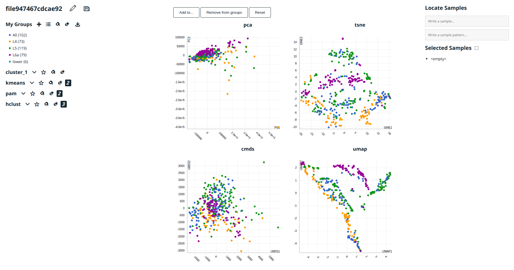
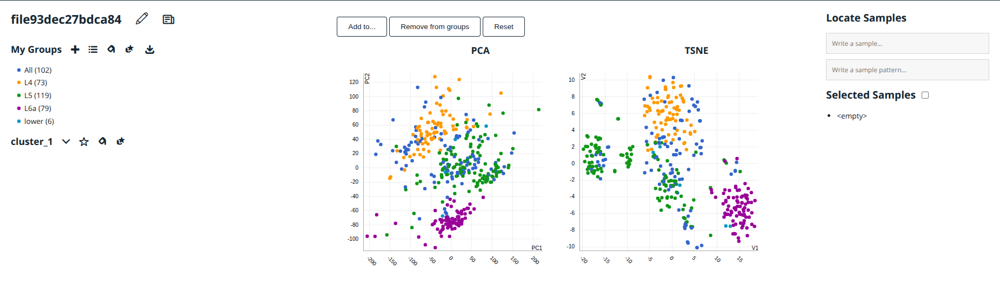

# Getting started

`looking4clusters` is an R package distributed as part of the Bioconductor
project.
To install the package, start R and enter:

```{r , echo=TRUE, message=FALSE, warning=FALSE, eval=FALSE}
if (!requireNamespace("BiocManager", quietly = TRUE)) {
    install.packages("BiocManager")
}
BiocManager::install("looking4clusters")
```
The GitHub repository for `looking4clusters` is
https://github.com/BioinfoUSAL/looking4clusters.
This is the place to file an issue, report a bug, or provide a pull request.

Once `looking4clusters` is installed, it can be loaded by the following
command.
```{r , echo=TRUE, message=FALSE, warning=FALSE, eval=TRUE}
library("looking4clusters")
```

# Introduction

looking4clusters performs interactive data visualization to facilitate the
analysis of scRNA-Seq. Input data are projected in two-dimensional
representations by applying dimensionality reduction methods such as: PCA, MDS,
t-SNE, UMAP, NMF. The representation of the data in the same interface with
interconnected graphs gives different perspectives which enable an adequate
cell classification.
The package also integrates the application of unsupervised clustering
techniques whose results can be viewed interactively in the graphical
interface. As a result, the package generates an interactive web page developed
with JavaScript that can be easily explored with a web browser. In addition to
the visualization, this interface allows the manual selection of groups,
labeling of cell entities based on processed meta-information, generation of
new graphs that show gene expression values of each cell, sample
identification, and visually comparison of samples and clusters.
Interactive visualization can be performed from a numeric matrix or a Seurat
Object.

# Interactive visualization from a numeric matrix

```{r echo=TRUE, message=FALSE, warning=FALSE}
# Load sample data from scRNAseq package
library(scRNAseq)
sce <- ReprocessedAllenData("tophat_counts")
counts <- t(assays(sce)$tophat_counts)

# Perform dimensional reduction and an automatic cluster identification
obj <- l4c(counts, groups=colData(sce)[,'dissection_s'])

# Output interactive visualization
plot(obj)
```

```{r echo=FALSE, out.width='100%'}

```

Alternatively you can iniltialize an object and then add clusters and
reductions
```{r echo=TRUE, message=FALSE, warning=FALSE}
# Create a new looking for cluster object
obj <- create_l4c(counts)

# Add a sample clasification from input data
groups <- colData(sce)[,'dissection_s']
obj <- add_cluster(obj, groups, myGroups=TRUE)

# Perform a PCA and add to the object as a dimensional reduction layout
pca <- prcomp(counts,scale=FALSE)
obj <- add_reduction(obj, pca$x[,1:2], "PCA")

# Output interactive visualization
plot(obj)
```

```{r echo=FALSE, out.width='100%'}

```

# Interactive visualization from a Seurat Object

```{r echo=TRUE, message=FALSE, warning=FALSE, eval=FALSE}
library(Seurat)
library(Matrix)

# Load sample data from ZilionisLungData
lung <- ZilionisLungData()
immune <- lung$Used & lung$used_in_NSCLC_immune
lung <- lung[,immune]
lung <- lung[1:10000,1:1000]

exp_mat <- Matrix(counts(lung),sparse = TRUE)
colnames(exp_mat) <- paste0(colnames(exp_mat), seq(1,ncol(exp_mat)))

# Create a new Seurat object
seurat_object <- CreateSeuratObject(counts = exp_mat, 
                                    project = "Zilionis_immune")

# Seurat data processing steps
seurat_object <- NormalizeData(seurat_object)
seurat_object <- ScaleData(seurat_object, features = rownames(seurat_object))

seurat_object <- FindVariableFeatures(seurat_object)
seurat_object <- RunPCA(seurat_object,
    features = VariableFeatures(object = seurat_object))

# Create a looking4clusters object from a Seurat object
obj <- l4c_Seurat(seurat_object)

# Output interactive visualization
plot(obj)
```

```{r echo=FALSE, out.width='100%'}

```

# SessionInfo {-}

```{r sessionInfo}
sessionInfo()
```
